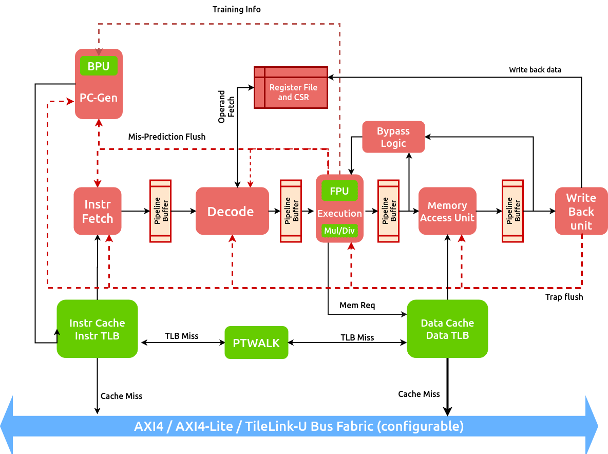

######################
Introduction
######################

What is C-Class 
---------------
C-Class is a member of the `SHAKTI <https://shakti.org.in>`_ family of processors.
It is an extremely configurable and commercial-grade 5-stage in-order core supporting the standard
RV64GCSUN ISA extensions. The core generator in this repository is capable of configuring the core
to generate a wide variety of design instances from the same high-level source code. The design instances
can serve domains ranging from embedded systems, motor-control, IoT, storage, industrial applications
all the way to low-cost high-performance linux based applications such as networking, gateways etc.

There have been multiple successful silicon `prototypes <http://shakti.org.in/tapeout.html>`_ 
of the different instances of the C-class thus proving its versatility. The extreme parameterization
of the design in conjunction with using an HLS like Bluespec, it makes it easy to add new features
and design points on a continual basis.

Why Bluespec
------------
The entire core is implemented in `Bluespec System Verilog (BSV) <https://github.com/BSVLang/Main>`_, 
an open-source high-level hardware description language. Apart from guaranteeing synthesizable
circuits, BSV also gives you a high-level abstraction, like going from assembly [level programming] 
to C. You don’t do the dirty work, the compiler does all the work for you. It enables users to work 
at a much higher level thereby increasing throughput. 

The language is now supported by an open-source Bluespec compiler, which can generate synthesizable
verilog compatible for FPGA and ASIC targets.

License
-------
All of the source code available in this repository is under the BSD license. 
Please refer to LICENSE.* files for more details.

Commercial Adoption
-------------------
The following startups have adopted SHAKTI C-Class for commercialization purposes:

1. InCore Semiconductors Pvt. Ltd.
2. Mindgrove Technologies Pvt. Ltd. 
